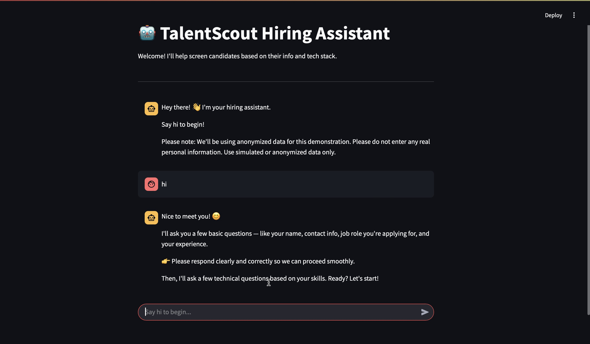

# 🤖 Hiring Assistant chatbot

A simple AI-powered chatbot that helps simulate the screening process for candidates applying for technical roles. Built using **Streamlit** for the frontend and **LLaMA2 (local model via Ollama)** for generating domain-specific technical interview questions.

**Note**: Due to the use of a local LLaMA2 model via Ollama for inference, this application is currently intended to be run locally. 

---

## Features

- Friendly and guided conversation flow
- Collects candidate information (name, email, experience, tech stack, etc.)
- Dynamically generates technical interview questions based on the provided tech stack
- Maintains session-based chat history
- Gracefully handles invalid inputs and exit commands
- Does **not** store or export any real candidate data

---

##  Tech Stack

- **Frontend**: [Streamlit](https://streamlit.io/)
- **LLM Backend**: Local [LLaMA2](https://ollama.com/) via Ollama API (http://localhost:11434)
- **Python Modules**: requests, streamlit

---

##  How It Works

The user is welcomed and asked to say "hi" to start.
The chatbot collects candidate information (like name, email, experience, etc.).
Based on the provided tech stack, the bot generates 5 technical questions.
The candidate answers these questions in a conversational manner.
At the end, a polite closing message is shown.

---

##  🔒 Data Privacy & Compliance

This version now includes optional data storage for candidate information. All sensitive fields such as full name and email are hashed using SHA-256 before saving, ensuring anonymity. The data is stored locally in a CSV file (candidates_data.csv) for demo purposes only.
✅ Name and email are hashed for privacy.

✅ Phone number is masked.

✅ Technical answers and other inputs are saved in a structured CSV format.

⚠️ No real personal data should be entered — please use simulated or anonymized data.

📦 No external storage or API is used — all data is stored locally and securely.

For production-level usage, compliance with data privacy laws (e.g., GDPR) should be ensured, including encryption, user consent, and secure storage mechanisms.

---

##  Running the App

1.Clone the repository:
git clone https://github.com/qubitsculptor/hiring-assistant-bot.git

2.Start your LLaMA2 model locally using Ollama:
ollama run llama2

3.Install dependencies (if needed):
pip install streamlit requests

4.Run the app:
streamlit run app.py

---

##  Prompt Logic

Technical questions are generated using the following prompt:
Based strictly on the tech stack below, generate 5 concise technical interview questions.
DO NOT include any explanations, intros, comments, difficulty levels, or anything else.
Only output the questions numbered from 1 to 5.
Tech stack: <user_input_here>
This ensures relevant, clear, and focused questions.

---

##  ⚠️ Note

This project is for demonstration purposes only.

___

## 📸 Screenshots

### 1. Welcome Screen

### 2. Technical Questions

